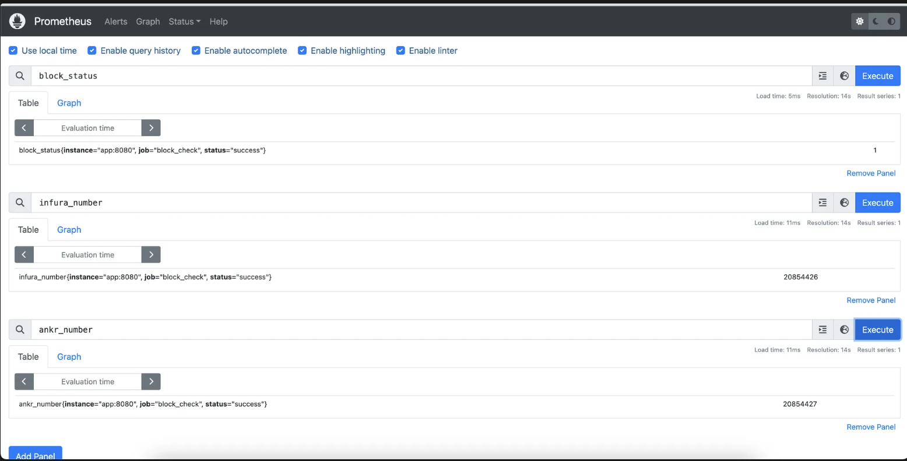
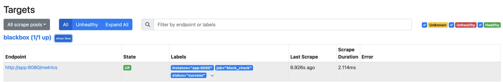

Write an application [http sd exporter](https://prometheus.io/docs/prometheus/latest/http_sd/). 

Your application needs write blackbox exporter check the difference in block number between two providers Ankr and Infura.:
-   if Ankr blocknumber - Infura blocknumber < 5 => success
-   else => fail

We're assuming that Infrura is the trusted source for checking the block number.

Note: Infura for sign up free account and docs https://www.ankr.com/rpc/eth/ and https://docs.infura.io/

Example: Get blocknumber with curl
```
curl https://mainnet.infura.io/v3/ID
-X POST \
-H "Content-Type: application/json" 
-d '{ 
 "jsonrpc": "2.0", 
 "method": eth_blockNumber, 
 "params": [], 
 "id": 1, 
}'
```
Please submit a link to a public GitHub repository with the source code of your solution. As an alternative, you may send a tar archive by email, but this is discouraged.


https://medium.com/@squadcast/prometheus-blackbox-exporter-a-guide-for-monitoring-external-systems-a8fff19a8bd0

# Solution

## Setup application 

(host , port of my app is http://app:8080)

I implement an application the handle the logic check the difference in block number between two providers (Ankr and Infura), the metrics will expose at **/metrics**

The http_sd_exporter of my app will host at **/health**

In the /health -> return HTTP_SD format, follow the document [http sd exporter](https://prometheus.io/docs/prometheus/latest/http_sd/). 

```json
[
  {
    "targets": [ "<host>", ... ],
    "labels": {
      "<labelname>": "<labelvalue>", ...
    }
  },
  ...
]
```

The host of target will be my application.

## Setup prometheus

Config prometheus to scrape http_sd_configs to the application

```yaml
scrape_configs:
  - job_name: "blackbox"
    http_sd_configs:
      - url: "http://app:8080/health"
        refresh_interval: 5s
```

## Check the result in Prometheus

Metrics

 

Service discovery

 

# How to run application

I already implement docker-compose file. To run my app, run this script to start docker-compose
```bash
docker-compose up --build
```